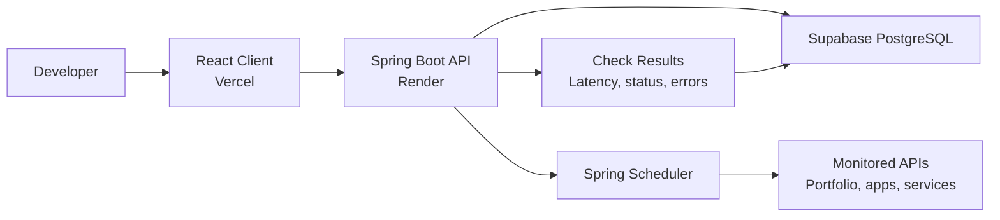

# UptimeDesk

**UptimeDesk is a full-stack API monitoring dashboard for developers who want a simple way to track uptime, latency, and service health across deployed projects.**

It is built as a practical portfolio project and as a real tool for monitoring personal applications, backend APIs, portfolio sites, and health-check endpoints.

## Overview

UptimeDesk lets you register API endpoints, define what a healthy response looks like, run checks manually, and collect scheduled health-check results over time.

The project is intentionally more than a basic CRUD app. The backend performs scheduled work, stores historical check results, and provides the foundation for incidents, alerts, uptime analytics, and public status pages.

## Key Features

Implemented:

- Create, view, update, and delete API monitors
- Configure monitor URL, HTTP method, expected status code, interval, timeout, and active state
- Optionally require a keyword in the response body for deeper health checks
- Optionally send custom request headers with health checks
- Configure how many consecutive failures are required before a monitor is marked down
- Run manual health checks from the dashboard
- Run scheduled backend checks
- Store check results with status code, latency, timestamp, and error details
- Record incident-rule outcomes when checks would open or resolve an incident
- View monitor status, configuration, and recent check results
- Search monitored services
- Display dashboard metrics and latency chart from collected check results
- Handle loading, empty, error, and backend-offline states

Planned:

- Uptime analytics for 24h, 7d, and 30d windows
- Incident tracking and incident timelines
- Email alerts for outages and recoveries
- Authentication and user-owned monitors
- Supabase PostgreSQL production database
- Public status pages
- Vercel frontend deployment
- Render backend deployment

## Use Cases

- Monitor a portfolio website
- Monitor a Spring Boot backend
- Monitor an ASP.NET API
- Track health-check endpoints for deployed projects
- Detect downtime before users report it
- Build a central dashboard for personal project reliability

## Architecture



## Tech Stack

Frontend:

- React
- Vite
- TypeScript
- Tailwind CSS
- TanStack Query
- Recharts
- Lucide React

Backend:

- Java 21
- Spring Boot 3.5
- Spring Web
- Spring Data JPA
- Spring Scheduler
- Spring Validation
- JUnit and MockMvc

Database and deployment:

- Local database: H2
- Production database: Supabase PostgreSQL
- Frontend deployment target: Vercel
- Backend deployment target: Render

## Project Structure

```text
UptimeDesk/
  client/   React + Vite frontend
  server/   Spring Boot backend
```

## How It Works

```text
Create a monitor
Choose URL, method, expected status, interval, and timeout
Spring Boot stores the monitor
Scheduler checks active monitors when they are due
Each result is saved with latency and status details
The dashboard shows monitor health and recent results
```

## Local Setup

Clone the repository:

```bash
git clone https://github.com/<your-username>/UptimeDesk.git
cd UptimeDesk
```

Start the backend:

```bash
cd server
./mvnw spring-boot:run
```

The backend runs at:

```text
http://localhost:8080
```

Start the frontend in a second terminal:

```bash
cd client
npm install
npm run dev
```

The frontend runs at:

```text
http://localhost:5173
```

The Vite dev server proxies `/api` requests to the Spring Boot backend.

## API Endpoints

```text
GET    /api/health
GET    /api/monitors
POST   /api/monitors
GET    /api/monitors/{id}
PUT    /api/monitors/{id}
DELETE /api/monitors/{id}
POST   /api/monitors/{id}/run
GET    /api/monitors/{id}/results
```

Example monitor creation:

```bash
curl -X POST http://localhost:8080/api/monitors \
  -H "Content-Type: application/json" \
  -d '{
    "name": "Portfolio API",
    "url": "https://example.com/api/health",
    "method": "GET",
    "expectedStatusCode": 200,
    "intervalMinutes": 5,
    "timeoutSeconds": 5
  }'
```

## Verification

Backend:

```bash
cd server
./mvnw test
```

Frontend:

```bash
cd client
npm run lint
npm run build
```

## Current Status

Completed:

- Monorepo structure with `client/` and `server/`
- Spring Boot API foundation
- React dashboard foundation
- Monitor CRUD backend
- Monitor management frontend
- Manual and scheduled checks
- Check result storage
- Retry-before-failure logic
- Custom request headers for health checks
- Incident-rule foundation for outage and recovery tracking
- Recent results UI and real latency chart data
- Backend integration tests
- Frontend lint and production build checks

Next milestones:

- Replace starter dashboard analytics with real uptime calculations
- Add incident detection and recovery tracking
- Connect production profile to Supabase PostgreSQL
- Add authentication and user-owned monitors
- Deploy frontend to Vercel and backend to Render

## Deployment Plan

Frontend on Vercel:

- Root directory: `client`
- Build command: `npm run build`
- Output directory: `dist`

Backend on Render:

- Root directory: `server`
- Build command: `./mvnw clean package`
- Start command: `java -jar target/*.jar`

Database:

- Supabase PostgreSQL
- Credentials supplied through environment variables
- Production migrations to be added with Flyway or Liquibase

## Portfolio Value

UptimeDesk demonstrates:

- Full-stack application structure
- REST API design
- Scheduled backend jobs
- Database modeling
- React dashboard development
- API state management
- Validation and error handling
- Testing with Spring Boot and MockMvc
- Realistic deployment planning

This project is designed to show practical engineering judgment, not just framework familiarity.
